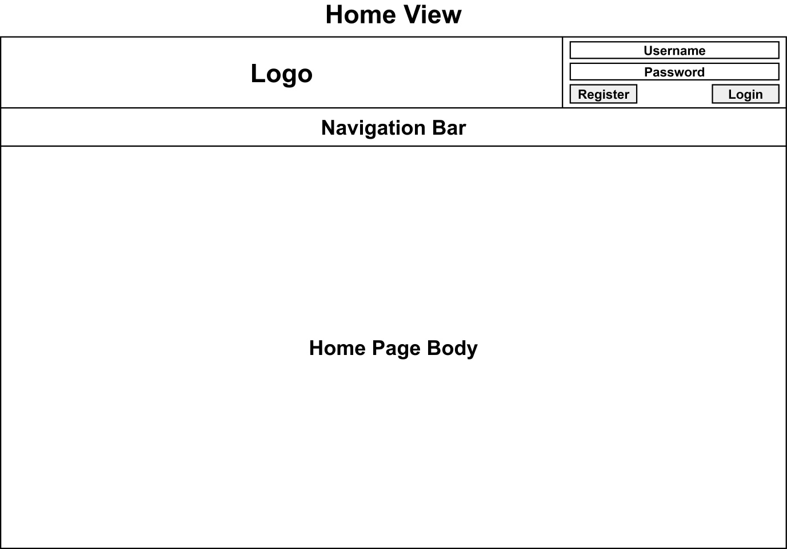
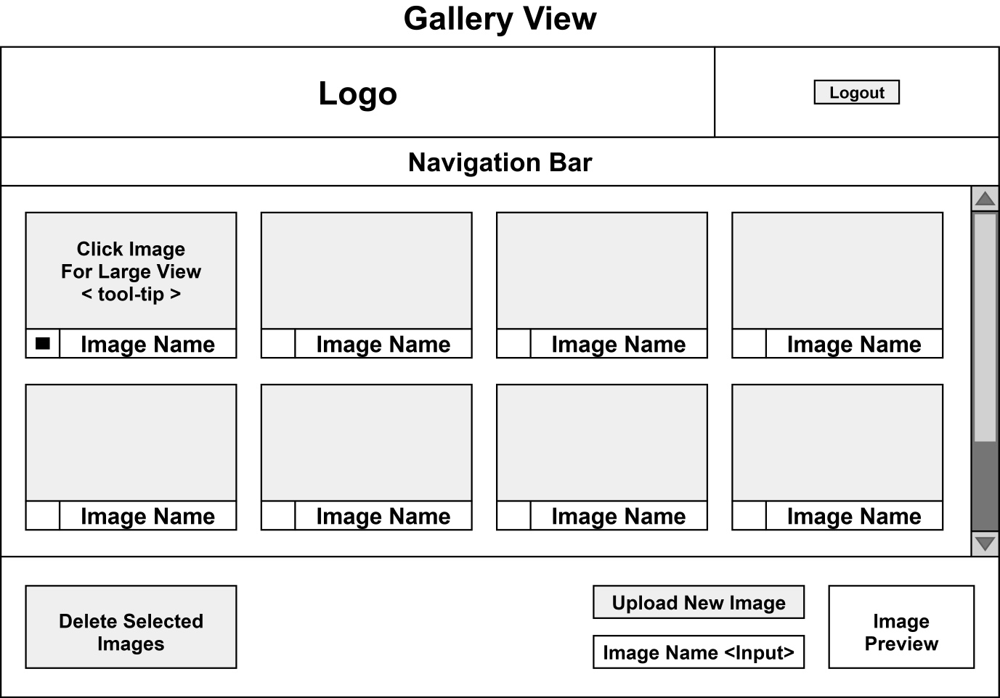
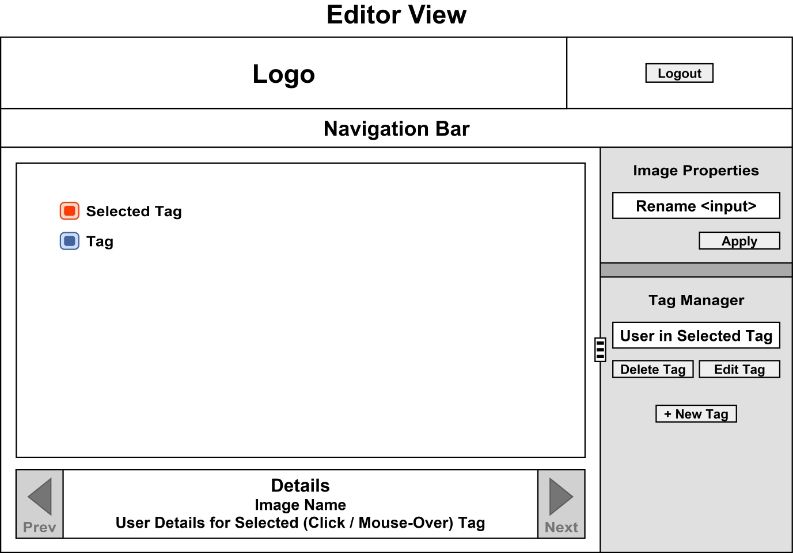

# **Tagged - Isomorphic**

* * *

## Contents
**[◄ Purpose ►](#purpose)**   

**[◄ Project Overview ►](#project-overview)**   
[Declarative TDD](#declarative-tdd)   
[Primary Modules Used](#primary-modules-used)   
[Wireframe Layout and Style Guide](#wireframe-layout-and-style-guide)   
[&nbsp;&nbsp;&nbsp;&nbsp;&nbsp;&nbsp; ► Wireframes](#wireframes)   
[&nbsp;&nbsp;&nbsp;&nbsp;&nbsp;&nbsp; ► Style Guide](#style-guide)   
[Release Backlog](#release-backlog)   
[&nbsp;&nbsp;&nbsp;&nbsp;&nbsp;&nbsp; ► Heading](#heading)   
[&nbsp;&nbsp;&nbsp;&nbsp;&nbsp;&nbsp; ► Home](#home)   
[&nbsp;&nbsp;&nbsp;&nbsp;&nbsp;&nbsp; ► Gallery](#gallery)   
[&nbsp;&nbsp;&nbsp;&nbsp;&nbsp;&nbsp; ► Editor](#editor)   
[Sprint Backlogs](#sprint-backlogs)   

**[◄ Critical Changes ►](#critical-changes)**   
[CSS Importing](#css-importing)  
 

- - -

# Purpose
The purpose of this project is to explore developing within an isomorphic environment. The project will serve as a source code view for the completed application being included within my portfolio.

Commenting within both the code and also describing the nature of commits will be crucial in maintaining a clear representation of the development process.

[Back to Top](#contents)

- - -

# Project Overview    
Tagged is a simple web application that allows a user to register / login and upload images from their device. Once uploaded, the user will be able to tag other registered users in their images using the editor provided.

All images will remain private exclusive to the user that uploaded them since the underlying functionality to include public and private galleries would not demand additional skills and therefore would not contribute anything substantial towards this project as a portfolio candidate.

Development will begin by establishing a basic stack environment and producing a "Hello World" test component using server-side rendering.  Once this is running, test driven development can begin.

An Agile Scrum management method will be deployed using [Taiga](https://tree.taiga.io/) with a new github branch being created at the completion of each Sprint Backlog.

The project will use Test Driven Development and testing will be carried out using [Karma + Karma-Webpack](https://github.com/substack/tape) based on [this setup](http://12devsofxmas.co.uk/2015/12/day-2-testing-react-applications/). The testing process will adhere to the following guidelines.

- All tests will be written before the code they are testing is developed.   

>Each test will initially fail and then pass when the code it is testing has been completed successfully.   

- Code rot will be avoided by removing interdependencies between functions/features where possible.
- Tests should be simple and fast to run.
- Keep test descriptions clear enough that they can be used as documentation.
- The intent of code should be defined by what you are testing.
- Spike Solutions (prototypes) should be basic representations of a problem and used to fill in knowledge gaps prior to starting the TDD process on a task.

[Back to Top](#contents)

- - -

## Declarative TDD   
Test Driven Development (TDD) is based on tests that are used to define the final product by testing **how a task should run**. This typically requires one or more additional steps that can be merged together if a Declarative approach is taken.

Declarative TDD is best demonstrated in the following short case study.

**Task**   
Build a Display Component that toggles visibility of a Rectangle by clicking a button.

**Imperative TDD Approach**   
- **Linear Step :** Map involved elements to complete the Task   

>Work out how many properties and functions are needed for the test by working through the sub-tasks step-by-step.   

- Create a test for the toggle function
- Build the toggle function to pass the test
- Pass props to the display component
- Create the display component with a button, container and child div elements using the props names passed in from the functional code being tested.
- Use CSS to shape the rectangle that will show/hide and style the button etc.

**Declarative TDD Approach**
- **Linear Step :** Create the display component with a button, container and child div elements.   

>Props required are defined in this step for onClick and CSS Display values.   

- Use CSS to shape the rectangle that will show/hide and style the button etc.
- Create a test for the toggle function
- Build the toggle function to pass the test
- Pass props to the display component

**Summary**   
Both approaches require an initial linear step that all consecutive steps have a dependency on.  The benefits of the Declarative approach are :
- A simplified development process, that combines the Imperative sub-task of producing a roadmap into the Declarative construction of the display component.   

>It is declarative because it is defining what the end result will look like in a declarative manner instead of using a Step-by-Step process to explain what needs to happen to reach this result.   

- It is more robust to changes because the roadmap and display component are one in the same thing.   

>Any change made to the display component is the equivalent of re-working the entire roadmap to include a change with cascading effects automatically factored into the equation.

Declarative TDD is still dynamic enough that additional, unknown props and content can be added to the "dumb" Display components any time and then tests can be produced.

[Back to Top](#contents)

- - -

## Primary Modules Used
The following list of modules is not exhaustive but will provide a quick overview of notable API's used in the development of Tagged.

- Webpack
- React (views)
- React-Router (routing views)
- SASS via PostCSS (precss plugin for advanced CSS using the SCSS syntax)
- Babel-Loader (transpiling)
- Mobservable (state management)
- ExpressJS (node.js server)
- Passport (social authentication)
- PG-Promise (db queries for postgreSQL)
- Dotenv (managing environment variables)

[Back to Top](#contents)

- - -

## Wireframe Layout and Style Guide
#### Wireframes
Below are the wireframe mock-ups for the layout of application views.   

  

- - -
 

  

- - -
 

  

Include a toggle button in the Details area to Hide/Show Tags with Tags off by default.  This will be a universal toggle so it will remember the individual user setting and apply it to all images displayed in the Editor View.   

Footer and Sidebar panels should be collapsible or shrinkable by the end user with state being saved.

[Back to Top](#contents)

- - -

#### Style Guide
**Font Family**   
Verdana, Arial, Helvetica, sans-serif   

**Colours**   
Logo Blue = rgba(0, 125, 241, 1)   
Sky Blue = rgba(180, 213, 242, 1)   
Navy = rgba(0, 12, 77, 1)   
Ice Blue = rgba(236, 248, 255, 1)   

**Other**   
A margin of 5px should be maintained between DOM elements where practicable.

[Back to Top](#contents)

- - -

## Release Backlog    
Tagged will be constructed from the following key components and User Stories (features listed as dot-points).

#### Heading
- Login and logout versions
- Tagged logo
- Additional information shared by all views
- Navigation bar when logged in

#### Home
- Basic information about Tagged
- Login and logout versions
- Logout version contains user statistics (images in gallery, number of times the user has been Tagged)

#### Gallery
- Private thumbnail image gallery
- Add and Remove images
- Click an image to open in the full editor

#### Editor
- Add, delete and modify tagged users in images
- Rename images
- Toggle tag visibility
- Toggle control panels

[Back to Top](#contents)

- - -

## Sprint Backlogs
Completion of the following Sprint Backlogs will signify the finalisation of this project.

1. Create display components (dumb)
2. Style display components (tweak DOM elements as needed)
3. Establish routing and view components
4. Configure passport for social login
5. Configure PostgreSQL database tables
6. Configure session management
7. Finalise view logic components (smart)

The order of these Sprint Backlogs is subject to change depending on requirements of specific modules to ensure testing is complete.

**Tests for Logic (smart) Components**   
The following tests will be slightly different when working with Mobservable to Redux (they were initially designed for redux).
- The rendering of a React component given a particular state
- The behaviour of a React component and how it affects the state via dispatched actions.
- The state or the application (the default values and how it changes with to subscribed actions)

The Agile-Scrum and TDD process will be managed via the [Tagged Isomorphic - Taiga Project Page](https://tree.taiga.io/project/jaxcavalera-tagged-isomorphic/).

[Back to Top](#contents)

- - -

# Critical Changes
During the development of Tagged Isomorphic there are likely to be some critical changes in the way that certain aspects of the development process are handled to best suit an isomorphic approach.

## CSS Importing
Initially the concept of View (smart) and Display (dumb) components is to divide the functional logic handling code from the display code. The benefits it provides are related to a separation of concerns and the ability to easily switch from one State Management Implementation to another without ever touching the display related code.

CSS files are not able to be imported or required by node.js normally and require the project to bundle them up with webpack or similar. The problem is that normal webpack CSS/Style modules/loaders are designed to work client side and so their usage for server-side rendering requires additional functional logic to be added into the components.

The best way to handle this is by moving the import statement from the Display components into the View components so that all additional "smart" code is handled in one place. There are Two (2) points that should be noted which directly relate to this change :

1. The use of CSS-Modules will not be commensurate with the continued usage of View / Display component pairs.    
>css-modules handle name-spacing your class names by replacing the string literals with variables and then parsing those variables to generate the class names.  (simplied explanation)
>
>Replacing class names in this way would impose significant code restructuring if it were to be used outside the context of a CSS-Modules based project and defeat one of the main benefits to using smart/dumb component pairs.

2. In order to use a Display component outside of the current project, a single line of code to import the CSS file directly into the component will be required.

[Back to Top](#contents)

- - -
